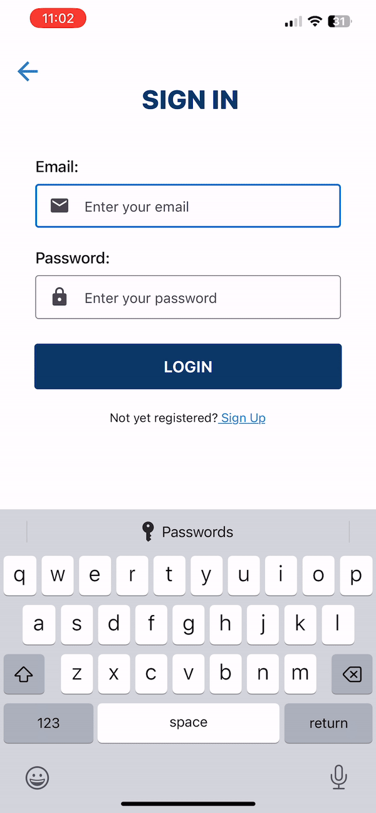

# My-Dose

My Dose is an light weight mobile insulin calculation app. Users can securely sign up and register for an account and get started right away. Upon initial sign-up the app will ask users to input some general information about their insulin sensitivity factor, carb ratio and target blood glucose. The application will save and display this data everytime the user goes to make a calculation, making the calculation process quick and simple. The application will also save the value of the calculated insulin dose as well as the time the dose was taken in a log so that insulin requirements can be reviewed by the users physician.

## Full Demo

[Full Demo Video](https://drive.google.com/file/d/1LRtE0humwKsqBgqnqPXLfWVZtEwqvU6q/view)

## Tech Stack

     

## Components

### Login

Users can login with the email and password they used when signing up for the account. If the password or email does not match an existing account the application will reject the login attempt and ask the user to provide valid login information.

### Signup

First time users will be asked to signup for an account using their email. They will also provide a first name, last name and password. If the email entered is associated with an existing account, the application will ask the user to provide another email.

### Base Line Levels

First time users of the application will be asked to enter their Insulin Sensitivity Factor, Carb Ratio and Target Blood Glucose. The information is then saved and used to make future insulin calculations.

### Calculation / Insulin History

Upon successful creation of an account, the user will be taken to the calculation screen where their baseline levels will be presented. Here the user can enter their current blood sugar and the grams of carbohydrates to be eaten and calculate their bolus insulin dose for the meal. The calculation will then be saved to a log that keeps track of every calculation and insulin dose the patient had made/taken.

